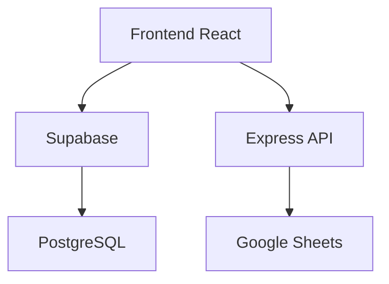

# Documentacao tecnica completa do sistema BooK+

## 1. Visao geral
O BooK+ e uma aplicacao web para gestao financeira e administrativa com integracao a planilhas do Google Sheets e geracao de relatorios em PDF. O sistema centraliza lancamentos (entradas e saidas), fornece visoes gerenciais (DRE, fluxo de caixa, fechamento) e apoia rotinas administrativas (tarefas e cadastros).

## 2. Objetivos de negocio
- Consolidar entradas e saidas financeiras em um unico cadastro (lancamentos).
- Permitir importacao rapida de dados financeiros via Google Sheets.
- Fornecer dashboards e relatorios para tomada de decisao.
- Manter um quadro simples de tarefas administrativas.
- Centralizar cadastros basicos (fornecedor, unidade).

## 3. Stack e dependencias
### Frontend
- React 18
- React Router
- React Helmet
- Framer Motion
- Radix UI
- Tailwind CSS
- Lucide React
- Recharts

### Backend
- Node.js (ESM)
- Express
- serve-static
- compression

### Integracoes
- Supabase (PostgreSQL + Auth)
- Google Sheets API

### Relatorios
- jsPDF
- jspdf-autotable
- html2canvas

## 4. Estrutura do repositorio
- src/: frontend
  - pages/: paginas principais
  - components/: componentes reutilizaveis
  - services/: integracoes
  - hooks/: hooks de estado
  - lib/: utilitarios
- server/: backend Express
- Documentacao/: documentacao e SQL legacy
- supabase/: scripts auxiliares

## 5. Execucao e scripts
### Scripts npm
- dev: inicia Vite em 127.0.0.1:3000
- build: build do frontend
- preview: preview do build
- start: server Express em producao

### Variaveis de ambiente
Frontend:
- VITE_SUPABASE_URL
- VITE_SUPABASE_ANON_KEY

Backend:
- GOOGLE_API_KEY
- GOOGLE_SHEET_PAGAMENTOS_ID
- GOOGLE_SHEET_RECEBIMENTOS_ID
- NODE_ENV

## 6. Arquitetura
### Visao geral
- Frontend em React consome dados do Supabase e chama a API Express para importacao.
- Backend Express serve o frontend em producao e fornece o endpoint de importacao.
- Supabase armazena dados e autentica usuarios.

### Fluxo de dados
1. Usuario acessa o frontend.
2. Frontend consulta Supabase (lancamentos, postit, etc.).
3. Integracao Google Sheets importa dados via backend.
4. Frontend grava dados processados no Supabase.

## 7. Banco de dados (Supabase)
Nao existem migracoes no repositorio. O schema abaixo e inferido pelo uso real no codigo.

### 7.1 Tabela lancamentos
Campos usados no codigo:
- id (PK)
- data (date)
- tipo (Entrada | Saida)
- unidade
- cliente_fornecedor
- descricao
- valor
- status
- obs
- aluno
- parcela
- desc_pontual
- datapag
- contato
- valor_aberto
- cpf_cnpj
- created_at

### 7.2 Tabela postit
Campos usados:
- id (PK)
- tarefa
- data
- concluida (S/N)
- created_at

### 7.3 Tabela clientes_fornecedores
Campos usados:
- id (PK)
- tipo
- descricao
- created_at

### 7.4 Tabela unidades
Campos usados:
- id (PK)
- descricao
- created_at

### 7.5 Scripts SQL sugeridos
```sql
create table if not exists public.lancamentos (
  id bigint generated by default as identity primary key,
  data date not null,
  tipo text not null check (tipo in ('Entrada', 'Saida')),
  unidade text,
  cliente_fornecedor text,
  descricao text,
  valor numeric(12,2) not null default 0,
  status text,
  obs text,
  aluno text,
  parcela text,
  desc_pontual numeric(12,2),
  datapag date,
  contato text,
  valor_aberto numeric(12,2),
  cpf_cnpj text,
  created_at timestamptz not null default now()
);
create index if not exists lancamentos_data_idx on public.lancamentos (data);
create index if not exists lancamentos_tipo_idx on public.lancamentos (tipo);
create index if not exists lancamentos_status_idx on public.lancamentos (status);

create table if not exists public.postit (
  id bigint generated by default as identity primary key,
  tarefa text not null,
  data timestamptz,
  concluida char(1) not null default 'N',
  created_at timestamptz not null default now()
);

create table if not exists public.clientes_fornecedores (
  id bigint generated by default as identity primary key,
  tipo text not null,
  descricao text not null,
  created_at timestamptz not null default now()
);
create index if not exists clientes_fornecedores_tipo_idx on public.clientes_fornecedores (tipo);

create table if not exists public.unidades (
  id bigint generated by default as identity primary key,
  descricao text not null,
  created_at timestamptz not null default now()
);
```

## 8. Backend (Express)
Arquivos principais:
- server/index.js: inicia o servidor, define HOST/PORT.
- server/app.js: cria app Express, configura rotas e serve frontend.

### Rotas backend
- GET /health: retorna { status: ok }.
- POST /api/google-sheets/import: busca dados do Google Sheets.

### Logica de importacao
1. Validar variaveis de ambiente do Google.
2. Buscar pagamentos (A:F) e recebimentos (A:V).
3. Retornar payload JSON com arrays para o frontend.

## 9. Frontend (React)
### Rotas principais
- / selecao de area
- /dashboard (financeiro)
- /administrativo
- /administrativo/tarefas
- /administrativo/relatorios
- /operacional
- /pedagogico
- /relatorios + subrotas
- /cadastros
- /contas-receber
- /contas-pagar
- /fluxo-caixa
- /financeiro
- /financeiro/cadastro
- /lancamentos
- /operacional/integracao

### Autenticacao
- Supabase Auth.
- PrivateRoute protege rotas privadas.

## 10. Processos detalhados
### 10.1 Importacao Google Sheets
- Frontend chama POST /api/google-sheets/import.
- Backend retorna arrays de dados.
- Frontend converte em lancamentos.
- Apaga lancamentos atuais e insere novos.

### 10.2 Cadastro de lancamentos
- Formulario com validacao.
- Campos obrigatorios: data, tipo, unidade, cliente_fornecedor, descricao, valor.
- Suporta recorrencia (daily/weekly/monthly).

### 10.3 Contas a pagar e receber
- Filtra por tipo.
- Permite dar baixa e registrar datapag.

### 10.4 Dashboard financeiro
- Consolida entradas/saidas do periodo.
- Calcula resultado operacional.
- Exibe grafico mensal.

### 10.5 Relatorio de fechamento
- Busca entradas/saidas ate o periodo.
- Ordena saidas por vencimento.
- Calcula saldo com cash.
- Exporta PDF.

### 10.6 Tarefas administrativas
- CRUD de tarefas.
- Concluir tarefa remove da lista principal.

### 10.7 Cadastros
- Fornecedor e unidade gravados em tabelas especificas.
- Aluno e turma ainda em desenvolvimento.

## 11. Prompts para criacao de telas
### Template
"""
Crie uma tela React com Tailwind seguindo o layout glass-card do projeto.
- Rota: /NOVA-ROTA
- Objetivo: [descrever]
- Dados: tabela X (campos...)
- Acoes: listar, criar, editar, excluir, exportar
- Estados: loading, vazio, erro
- Integracao: Supabase via customSupabaseClient
"""

### Exemplo: relatorio
"""
Crie uma tela de relatorio em React para consolidar entradas e saidas por periodo.
Use jsPDF para exportar PDF. Consuma Supabase tabela lancamentos.
Inclua filtros de unidade, periodo e status. Layout com glass-card.
"""

## 12. Diretrizes de design
- Tema escuro com glass-card.
- Tipografia em branco e cinza.
- Botoes primary azul, outline para secundario.
- Grid responsivo.

### Exemplos de classes utilitarias
- Card: glass-card p-6 border border-white/10 rounded-xl
- Tabela: min-w-full text-sm text-gray-200
- Botao primary: bg-blue-600 hover:bg-blue-700 text-white

## 13. Exemplos de payloads e queries por tela

### AreaSelection (/)
Query:
```js
// nao ha query; apenas navegacao
```

### Dashboard (/dashboard)
Query (carrega lancamentos):
```js
const { data, error } = await supabase
  .from('lancamentos')
  .select('*');
```

### Contas a Receber (/contas-receber)
Query:
```js
const { data, error } = await supabase
  .from('lancamentos')
  .select('*')
  .eq('tipo', 'Entrada');
```
Payload de baixa:
```js
await supabase
  .from('lancamentos')
  .update({ status: 'Pago', datapag: '2026-01-14' })
  .eq('id', 123);
```

### Contas a Pagar (/contas-pagar)
Query:
```js
const { data, error } = await supabase
  .from('lancamentos')
  .select('*')
  .eq('tipo', 'Saida');
```
Payload de baixa:
```js
await supabase
  .from('lancamentos')
  .update({ status: 'Pago', datapag: '2026-01-14' })
  .eq('id', 456);
```

### Fluxo de Caixa (/fluxo-caixa)
Query:
```js
const { data, error } = await supabase
  .from('lancamentos')
  .select('*');
```

### Relatorio de Fechamento (/relatorios/fechamento)
Query:
```js
const { data, error } = await supabase
  .from('lancamentos')
  .select('id, cliente_fornecedor, contato, aluno, data, unidade, valor, valor_aberto, desc_pontual, tipo, status')
  .lte('data', endDateIso)
  .or('status.is.null,status.neq.Pago');
```

### Administrativo (/administrativo)
Query:
```js
const { data, error } = await supabase
  .from('postit')
  .select('*');
```
Payload de conclusao:
```js
await supabase
  .from('postit')
  .update({ concluida: 'S' })
  .eq('id', tarefaId);
```

### Administrativo Tarefas (/administrativo/tarefas)
Payload de criacao:
```js
await supabase
  .from('postit')
  .insert([{ tarefa: 'Nova tarefa', data: '2026-01-14', concluida: 'N' }]);
```

### Cadastros (/cadastros)
Payload de fornecedor:
```js
await supabase
  .from('clientes_fornecedores')
  .insert([{ tipo: 'Fornecedor', descricao: 'Distribuidora XPTO' }]);
```
Payload de unidade:
```js
await supabase
  .from('unidades')
  .insert([{ descricao: 'CNA Angra dos Reis' }]);
```

### Lancamentos (/lancamentos)
Payload de criacao:
```js
await supabase
  .from('lancamentos')
  .insert([{
    data: '2026-01-14',
    tipo: 'Entrada',
    unidade: 'CNA Angra dos Reis',
    cliente_fornecedor: 'Cliente X',
    descricao: 'Mensalidade',
    valor: 150.0,
    status: 'A Vencer'
  }]);
```

### Integracao (/operacional/integracao)
Payload:
```js
await fetch('/api/google-sheets/import', { method: 'POST' });
```

## 14. Reconstrucao 100% (detalhamento adicional)

### 14.1 Padrao visual completo
- Background global: gradiente `from-slate-900 via-blue-900 to-indigo-900` aplicado no container principal.
- Fonte: sans-serif padrao do projeto (mantida pelo Tailwind).
- Titulo de pagina: `text-3xl font-bold gradient-text`.
- Texto secundario: `text-gray-300` ou `text-gray-400`.
- Cards: classe base `glass-card` + borda `border border-white/10` + cantos `rounded-xl`.
- Botao primario: `bg-blue-600 hover:bg-blue-700 text-white`.
- Botao outline: `border-blue-500 text-blue-300 hover:bg-blue-500/10`.
- Animacoes: entrada com `framer-motion` (opacity + y).

### 14.2 Componentes obrigatorios (UI)
- Card, CardHeader, CardContent, CardTitle (Radix + estilos).
- Button com variantes default e outline.
- Select, Input, Textarea, Label do design system.
- Toast para sucesso/erro.

### 14.3 Regras de negocio detalhadas
#### Status de lancamentos
- Status inicial no cadastro manual: A Vencer.
- Status Pago aplicado quando usuario da baixa (contas a pagar/receber).
- Status Atrasado inferido nos relatorios e dashboards quando data < hoje e status != Pago.

#### Valor considerado
- Quando houver valor_aberto > 0, usar este valor para calculos.
- Quando houver desc_pontual, usar este valor para desconto pontual, exibindo em relatorios se aplicavel.

#### Relatorio de fechamento
- Entradas e saidas: filtrar por data <= fim do periodo.
- Excluir registros com status Pago.
- Ordenar saidas por vencimento.
- Saldo final = total entradas - total saidas.
- Saldo final com cash = saldo final + emCashValue.

#### Importacao Google Sheets
- Ignorar linhas com valor <= 0.01.
- Campos vazios viram null quando aplicavel (contato, aluno, cpf_cnpj).
- Antes de inserir, remover todos os registros existentes em lancamentos.
- Inserir em lotes de 500 registros.

### 14.4 Especificacao por tela (campos e fluxos)
#### AreaSelection (/)
- Cards: Administrativo, Operacional, Financeiro, Relatorios, Pedagogico.
- Cada card deve navegar para sua rota correspondente.

#### Dashboard (/dashboard)
- Mostra cards: Total a Receber, Total a Pagar, Resultado Operacional.
- Grafico mensal: entradas x saidas (Recharts).
- Ajuste de saldo em cash com input e botao confirmar.

#### Contas a Receber (/contas-receber)
- Lista lancamentos tipo Entrada.
- Filtros por cliente, status, data e unidade.
- Botao de baixa marca status Pago e grava datapag.

#### Contas a Pagar (/contas-pagar)
- Lista lancamentos tipo Saida.
- Filtros por fornecedor, status, data e unidade.
- Botao de baixa marca status Pago e grava datapag.

#### Fluxo de Caixa (/fluxo-caixa)
- Consolida entradas e saidas por dia.
- Mostra saldos diarios e acumulados.

#### Fluxo de Caixa Detalhado (/relatorios/fluxo-caixa-detalhado)
- Tabela detalhada por dia, com expand/collapse.

#### DRE Gerencial (/relatorios/dre-gerencial)
- Separa entradas e saidas por categorias (custo/despesa).
- Calcula resultado do periodo.

#### Relatorio de Fechamento (/relatorios/fechamento)
- Filtros: unidade e periodo (mensal/semanal/diario).
- Tabelas de entradas e saidas.
- Exportar PDF.

#### Impressao DOC (/relatorios/impressao-doc)
- Seleciona lancamentos e gera PDF com layout padrao.

#### Emissao Duplicata (/relatorios/emissao-duplicata)
- Seleciona entradas e gera documento PDF de cobranca.

#### Mapa Mensal (/relatorios/mapa-mensal)
- Visao mensal com entradas/saidas por dia.

#### Administrativo (/administrativo)
- Lista post-it pendentes.
- Concluir tarefa remove da lista.
- Alterar data da tarefa.

#### Administrativo Tarefas (/administrativo/tarefas)
- CRUD completo de tarefas.

#### Cadastros (/cadastros)
- Abas: aluno, responsavel, fornecedor, unidade, turma, lancamento.
- Fornecedor e unidade gravam no Supabase.

#### Operacional (/operacional)
- Acesso a integracoes e rotinas.

#### Pedagogico (/pedagogico)
- Exibe indicadores (Quantidade de Alunos, Turmas).

### 14.5 Politicas Supabase (RLS)
- Ativar RLS em todas as tabelas.
- Politica basica: permitir select/insert/update/delete apenas para usuarios autenticados.

Exemplo (ajustar no Supabase):
```sql
create policy "authenticated read" on public.lancamentos
  for select using (auth.role() = 'authenticated');
create policy "authenticated write" on public.lancamentos
  for insert with check (auth.role() = 'authenticated');
create policy "authenticated update" on public.lancamentos
  for update using (auth.role() = 'authenticated');
create policy "authenticated delete" on public.lancamentos
  for delete using (auth.role() = 'authenticated');

-- Replicar para postit, clientes_fornecedores, unidades.
```

### 14.6 Seed de dados (opcional)
```sql
insert into public.unidades (descricao) values
  ('CNA Angra dos Reis'),
  ('CNA Mangaratiba'),
  ('Casa');

insert into public.clientes_fornecedores (tipo, descricao) values
  ('Fornecedor', 'Distribuidora XPTO');

insert into public.postit (tarefa, data, concluida) values
  ('Revisar pagamentos', now() + interval '2 days', 'N');
```

### 14.7 Checklist de reconstrucao
- Configurar Supabase e executar scripts SQL.
- Configurar variaveis de ambiente do frontend e backend.
- Subir o backend Express (start).
- Subir o frontend Vite (dev).
- Validar integracao Google Sheets.
- Validar rotas e relatorios PDF.

### 14.8 Diagrama final (mermaid)


## 15. Validacoes finais
- Rotas carregam sem erros.
- Importacao com Google Sheets funcionando.
- Supabase conectado com tabelas descritas.
- Relatorios em PDF gerados corretamente.
